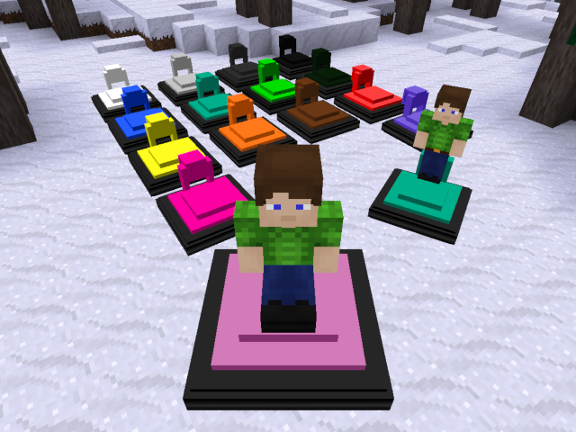

Hovercramt Version 1.00
=======================

Overview
--------

A fun alternative mode of transport for Minetest.

Hovercramt is a mod that adds hovercraft to the Minetest game.  
You can ride them and run around the world.  

This is a fork by michyo from hovercraft (by Stuart Jones).  
(Hovercramt GitHub repository: [https://github.com/michyo/hovercramt](https://github.com/michyo/hovercramt))  
(GitHub of original hovercraft: [https://github.com/stujones11/hovercraft](https://github.com/stujones11/hovercraft))  

I have added 11 colors to cover all 15 colors of wool.  
Hovercraft have been changed to have the same specifications regardless of color.  

And, I fixed a strange mechanism movement affect other hovercraft of the same color.  
(In the original hovercraft, the hovercraft of the same color as you are riding will move (without the pilot) following your movement.)  

And adjusted to work correctly in Minetest version 5.2.0.  
(Original hovercraft in Minetest version 5.2.0, you can't get off. But this one, you can get off.)  

Screenshot
----------

Installation
------------

1. Download zip. ([https://github.com/michyo/hovercramt/archive/master.zip](https://github.com/michyo/hovercramt/archive/master.zip))  
2. Unpack it in one folder and put it in your Minetest mods folder.  
3. Enable it in the Minetest.  

Depends
-------

* default
* wool
* dye

Controls
--------

    Thrust          : Forward (W)  
    Jump            : Jump (Space)  
    Rotate          : Mouse move  
    Sit             : Sneak (Shift)
    Put & collect   : Left mouse button  
    Getting on & off: Right mouse button  

Recipe
------

#### White Hovercraft (hovercramt:hover_white)

    ''          , ''          , 'default:steelblock'  
    'wool:white', 'wool:white', 'wool:white'  
    'wool:black', 'wool:black', 'wool:black'  

#### Grey Hovercraft (hovercramt:hover_grey)

    ''          , ''          , 'default:steelblock'  
    'wool:grey' , 'wool:grey' , 'wool:grey'  
    'wool:black', 'wool:black', 'wool:black'   

#### Dark Grey Hovercraft (hovercramt:hover_darkgrey)

    ''              , ''              , 'default:steelblock'  
    'wool:dark_grey', 'wool:dark_grey', 'wool:dark_grey'  
    'wool:black'    , 'wool:black'    , 'wool:black'  

#### Black Hovercraft (hovercramt:hover_black)

    ''          , ''          , 'default:steelblock'  
    'wool:black', 'wool:black', 'wool:black'  
    'wool:black', 'wool:black', 'wool:black'  

#### Blue Hovercraft (hovercramt:hover_blue)

    ''          , ''          , 'default:steelblock'  
    'wool:blue' , 'wool:blue' , 'wool:blue'  
    'wool:black', 'wool:black', 'wool:black'  

#### Cyan Hovercraft (hovercramt:hover_cyan)

    ''          , ''          , 'default:steelblock'  
    'wool:cyan' , 'wool:cyan' , 'wool:cyan'  
    'wool:black', 'wool:black', 'wool:black'  

#### Green Hovercraft (hovercramt:hover_green)

    ''          , ''          , 'default:steelblock'  
    'wool:green', 'wool:green', 'wool:green'  
    'wool:black', 'wool:black', 'wool:black'  

#### Dark Green Hovercraft (hovercramt:hover_darkgreen)

    ''               , ''               , 'default:steelblock'  
    'wool:dark_green', 'wool:dark_green', 'wool:dark_green'  
    'wool:black'     , 'wool:black'     , 'wool:black'  

#### Yellow Hovercraft (hovercramt:hover_yellow)

    ''           , ''           , 'default:steelblock'  
    'wool:yellow', 'wool:yellow', 'wool:yellow'  
    'wool:black' , 'wool:black' , 'wool:black'  

#### Orange Hovercraft (hovercramt:hover_orange)

    ''           , ''           , 'default:steelblock'  
    'wool:orange', 'wool:orange', 'wool:orange'  
    'wool:black' , 'wool:black' , 'wool:black'  

#### Brown Hovercraft (hovercramt:hover_brown)

    ''          , ''          , 'default:steelblock'  
    'wool:brown', 'wool:brown', 'wool:brown'  
    'wool:black', 'wool:black', 'wool:black'  

#### Red Hovercraft (hovercramt:hover_red)

    ''          , ''          , 'default:steelblock'  
    'wool:red'  , 'wool:red'  , 'wool:red'  
    'wool:black', 'wool:black', 'wool:black'  

#### Pink Hovercraft (hovercramt:hover_pink)

    ''          , ''          , 'default:steelblock'  
    'wool:pink' , 'wool:pink' , 'wool:pink'  
    'wool:black', 'wool:black', 'wool:black'  

#### Magenta Hovercraft (hovercramt:hover_magenta)

    ''            , ''            , 'default:steelblock'  
    'wool:magenta', 'wool:magenta', 'wool:magenta'  
    'wool:black'  , 'wool:black'  , 'wool:black'  

#### Violet Hovercraft (hovercramt:hover_violet)

    ''           , ''           , 'default:steelblock'  
    'wool:violet', 'wool:violet', 'wool:violet'  
    'wool:black' , 'wool:black' , 'wool:black'  

Know Issues
-----------

'Bouncing' into thin air: This can simply be the result of server lag, even in singleplayer mode, the client and server can get out of sync.  
Solution, be patient, allow the environment to fully load before preceding.

Version History
---------------

#### 1.00 (2020/04/12):

* Initial release

License
-------

Copyright (C) 2020 michyo (Michiyo Tagami) [[https://michyo.net/](https://michyo.net/)]  

#### Code: LGPL 3.0

    Original hovercraft: Stuart Jones  
    Hovercramt: michyo (Michiyo Tagami)  

#### Textures & models

    CC-BY-SA 3.0: Stuart Jones  

The following 11 color textures have been added by michyo.  
(Based on Stuart Jones's original texture.)  
[White, Grey, Dark Grey, Black, Cyan, Dark Green, Orange, Brown, Pink, Magenta, Violet]  

    CC-BY-SA 3.0: michyo & Stuart Jones  

#### Sounds

    CC0         : Rocket Boost Engine Loop by qubodup (freesound.org)  
    CC-BY 3.0   : CARTOON-BING-LOW by kantouth (freesound.org)  
    CC-BY-SA 3.0: All other sounds: Copyright Stuart Jones  

See the LICENSE.txt for more details.  
